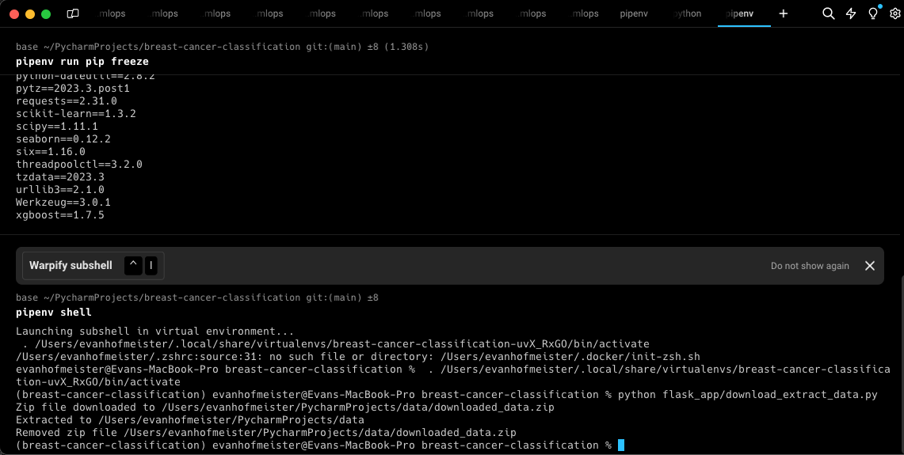
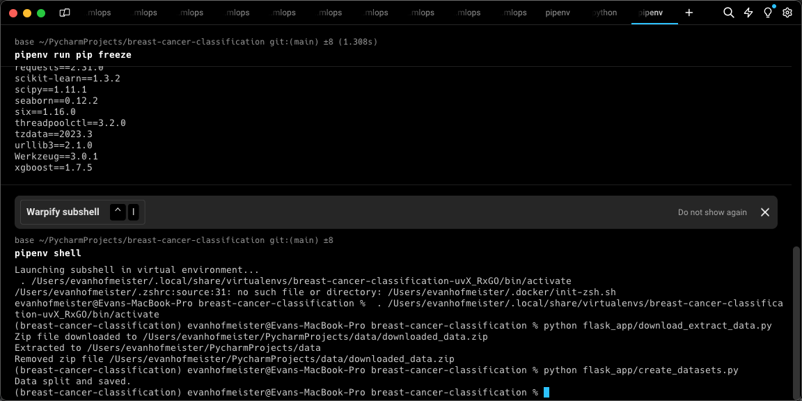
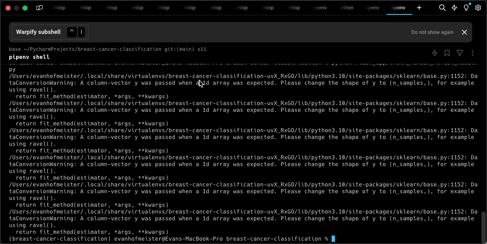
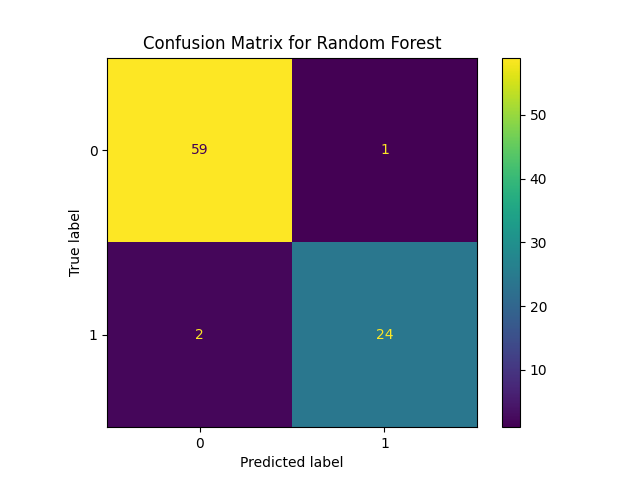
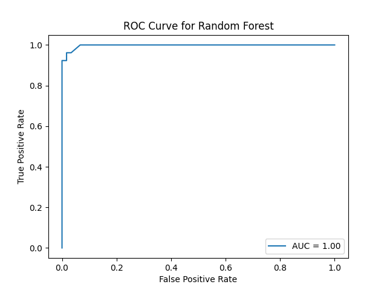
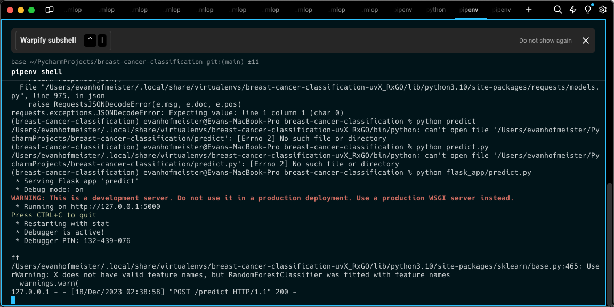
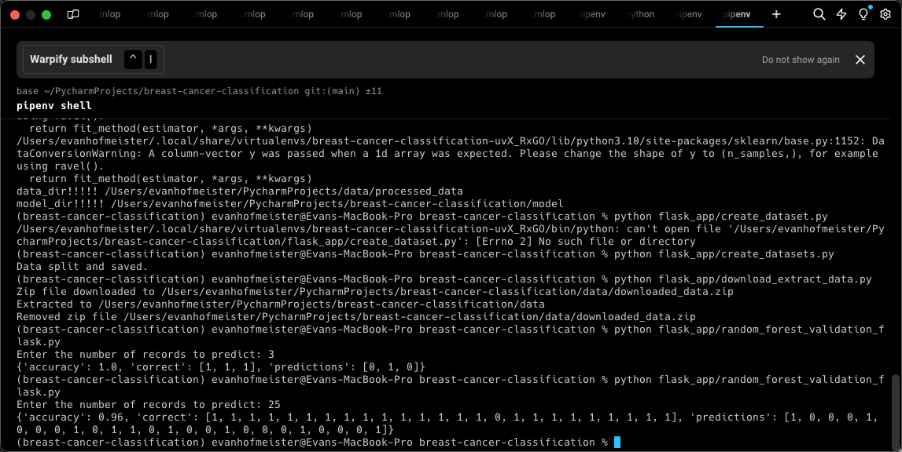
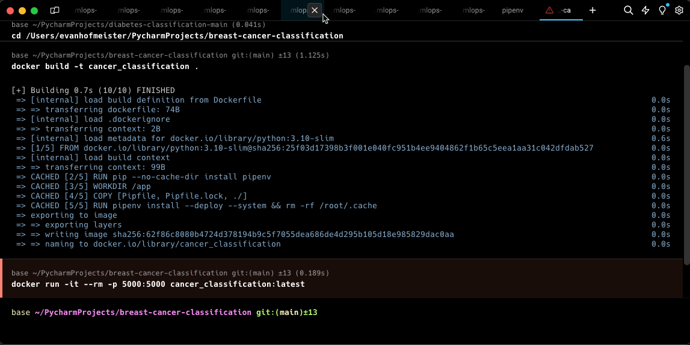

# **Breast Cancer Classification**
<center></center>

# **Project Overview**
This project focuses on classifying breast cancer tumors as either benign or malignant. Utilizing the Breast Cancer Wisconsin (Diagnostic) dataset, various machine learning models are applied and contrasted.

### Data Source
[The Breast Cancer Wisconsin (Diagnostic) dataset](https://archive.ics.uci.edu/ml/datasets/Breast+Cancer+Wisconsin+(Diagnostic)), available from the UCI Machine Learning Repository, consists of features computed from a digitized image of a fine needle aspirate (FNA) of a breast mass. It contains 569 instances, each with 30 real-valued features, providing data on the characteristics of the cell nuclei. The objective of the dataset is to classify whether the breast cancer is benign or malignant.

There are 32 rows in the dataset where the first two are the index and target. The remaining 30 can be divided into groups of 10 where:
* 3-12: Mean of `a-j`
* 13-22: SE of `a-j`
* 23-32: Worst (defined for each metric) of `a-j`


    a) ID Number (Index)
    b) Target: Diagnosis (M = malignant, B = benign)
	a) radius (mean of distances from center to points on the perimeter)
	b) texture (standard deviation of gray-scale values)
	c) perimeter
	d) area
	e) smoothness (local variation in radius lengths)
	f) compactness (perimeter^2 / area - 1.0)
	g) concavity (severity of concave portions of the contour)
	h) concave points (number of concave portions of the contour)
	i) symmetry 
	j) fractal dimension ("coastline approximation" - 1)


### Methodology
* Data Preprocessing: The dataset is cleaned and normalized and analyzed to capture any relationships between features/targets.
* Feature Engineering: Key features are selected based on a survey of methods.
* Model Building: I experiment with several machine learning algorithms, including Logistic Regression, Decision Trees, Random Forest, XGBoost, and ANN.
* Evaluation: Models are evaluated based on accuracy, precision, and recall metrics to determine the most effective approach.

### Results
The best results were achieved with an optimized Random Forest model, yielding an AUC of `0.986` and an F1 score of `0.968`. This work not only demonstrates the potential of machine learning in healthcare but also provided hands-on experience with Scikit-learn and Flask, expanding my experience with both model development and application deployment.

### Instructions for setting up project and installing dependencies

Install Pipenv: If you haven't installed Pipenv, you can do so using pip:
```sh
pip install pipenv
```

Install Dependencies: Install your project's dependencies with Pipenv,
```sh
pipenv install
```

Activate the Pipenv Environment:
```sh
pipenv shell
```

Jupyter Notebook can be started within the Pipenv using the following command
```sh
jupyter notebook
```

Additional commands that may be useful to know when working with pipenv:


Output virtual env information:
```sh
pipenv --venv
```

List installed packages:
```sh
pipenv run pip list
```

Remove virtual environment (on current folder):
```sh
pipenv --rm
```


### To train, optimize, create, and validate a random forest model, follow the below instructions:

1) #### download_and_extract_zip(url, data_directory)

Purpose: Downloads and extracts a ZIP file from a specified URL to a data directory.
```sh
python flask_app/download_extract_data.py
```


2) #### create_datasets()

Purpose: Splits a dataset into training, validation, and testing sets, then saves them as CSV files.
```sh
python flask_app/create_datasets.py
```


3) #### train_random_forest_model.py()

Purpose: Trains random forest model and optimizes parameters using grid search.
```sh
python train_random_forest_model.py
```





4) #### predict.py()

Purpose: Host the service locally using the virtual environment using flask.
```sh
python predict.py
```


5) #### random_forest_validation_flask.py(X, y, num_records)

Purpose: Sends a prediction request to a Flask API for a specified number of records.
```sh
python random_forest_validation_flask.py
```


### Additional supporting py files

#### train_model(model, param_grid, X_train, y_train, cv_folds)

Purpose: Trains a machine learning model using GridSearchCV for hyperparameter tuning.
```sh
Example: train_model(RandomForestClassifier(), {"n_estimators": [100, 200]}, X_train, y_train, 5)
```
#### evaluate_model(model, X_test, y_test, model_name, results_dict)

Purpose: Evaluates a trained model on the test set using various metrics, displays results.
```sh
Example: evaluate_model(trained_model, X_test, y_test, "Random Forest", {})
```

### Deployment with Docker

To deploy the project with the provided Docker container, fist start the Docker Daemon, then run the follow commands:

Build the container:
```sh
docker build -t cancer_classification .
```

Run the container:
```sh
docker run -it --rm -p 5000:5000 cancer_classification:latest
```



After this step feel free to refer to the instructions detailed in the earlier sections to interact with the model and flask application.

### Introduction of machine learning methods
In this project, I conducted a survey comparison of various machine learning methods to address a classification problem using the Breast Cancer Wisconsin dataset. The aim was to evaluate and understand the effectiveness and suitability of each method for medical diagnosis prediction tasks.

* Logistic Regression: A fundamental linear model used for binary classification. It's valued for its simplicity, interpretability, and efficiency, making it a good baseline model for this study.

* Support Vector Machine (SVM): Renowned for its effectiveness in high-dimensional spaces, SVM is particularly adept at creating complex decision boundaries, even with limited data.

* Random Forest: An ensemble method that builds multiple decision trees and merges their predictions. Known for its robustness, it's effective in handling overfitting and providing high accuracy.

* XGBoost: An implementation of gradient boosted decision trees designed for speed and performance. XGBoost is celebrated for its scalability and effectiveness across a wide range of classification problems.

* Artificial Neural Network (ANN): A deep learning method capable of capturing complex patterns in data. ANNs are highly flexible and can model intricate relationships, making them a powerful tool in predictive analytics.

### Optimization

In the optimization of each machine learning model, specific parameters were selected to analyze with GridSearch:

* Logistic Regression:
  * C: Controls regularization strength. Lower values increase regularization, helping to reduce overfitting.
  * penalty: Specifies the norm used in penalization, 'l2' for Ridge and 'l1' for Lasso regularization.
  * solver: Algorithm for optimization, e.g., 'liblinear' for small datasets and 'saga' for larger datasets.

* Support Vector Machine (SVM):

  * C: Regularization parameter, similar to Logistic Regression. Balances classification accuracy and decision boundary smoothness.
  * gamma: Defines the influence of a single training example. Low values imply far reach, high values imply close reach.
  * kernel: Determines the type of hyperplane used to separate data, e.g., linear, polynomial, or radial basis function.
  
* Random Forest:

  * n_estimators: The number of trees in the forest. More trees can increase accuracy but also computation time.
  * max_depth: Maximum depth of each tree. Deeper trees can capture more complex patterns but might overfit.
  * min_samples_split and min_samples_leaf: Control the growth of each tree, affecting the model's complexity.
  
* XGBoost:

  * n_estimators: Number of gradient boosted trees. More trees can improve performance but risk overfitting.
  * learning_rate: Shrinks the contribution of each tree, preventing overfitting.
  * max_depth: Maximum depth of a tree, controlling complexity.
  * subsample: Fraction of samples used for fitting individual base learners.
  * colsample_bytree: Fraction of features used when constructing each tree.
  
* Artificial Neural Network (ANN):

  * Number of layers and neurons: Defines the depth and width of the network, impacting its ability to learn complex patterns.
  * Activation function: Determines the output of a node given an input or set of inputs.
  * Learning rate: Controls how much to adjust the model in response to the estimated error each time the model weights are updated.
  * Optimizer: Algorithm or method used to change the attributes of the neural network such as weights and learning rate to reduce losses.

### Future Work
* Integrate more advanced machine learning and deep learning models.
* Conduct a more granular analysis of feature importance.
* Expand analysis to clinical/more expansive datasets.
* Finish implementing model in cloud platform (implementation on AWS 90% complete - to do: update readme with instruction)

License
This project is licensed under the MIT License - see the LICENSE.md file for details.