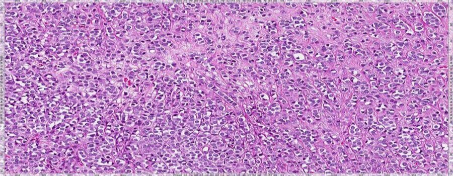
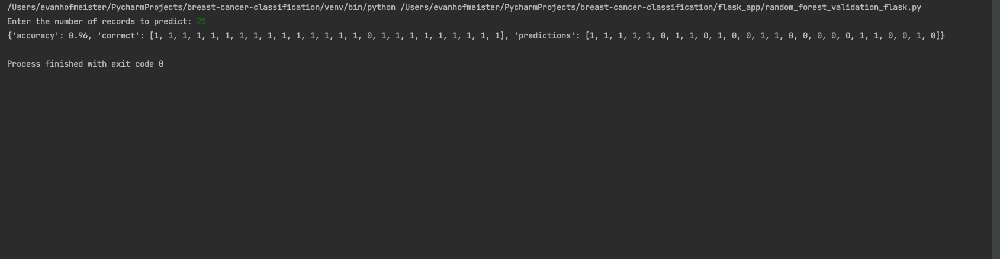

# **Machine Learning for Breast Cancer Detectionr**
<center></center>

# **Project Overview**
This project applies machine learning (ML) techniques to the Breast Cancer Wisconsin dataset for cancer diagnosis, inspired by "Machine learning in medicine: a practical introduction" by Sidey-Gibbons and Sidey-Gibbons. The study highlights the utility of ML in healthcare, specifically in predictive modeling for cancer. Utilizing General Linear Model (GLM) regression, Support Vector Machines (SVMs), and Artificial Neural Networks (ANNs), the project aims to demonstrate the effectiveness of ML algorithms in medical diagnosis and outcome prediction. Emphasizing the importance of open-source tools and public data, this project serves as an example of leveraging ML to enhance medical research and clinical care.


#### Introduction of machine learning methods
In this project, we conducted a comprehensive comparison of various machine learning methods to address a classification problem using the Breast Cancer Wisconsin dataset. The aim was to evaluate and understand the effectiveness and suitability of each method for medical diagnosis prediction tasks.

Logistic Regression: A fundamental linear model used for binary classification. It's valued for its simplicity, interpretability, and efficiency, making it a good baseline model for this study.

Support Vector Machine (SVM): Renowned for its effectiveness in high-dimensional spaces, SVM is particularly adept at creating complex decision boundaries, even with limited data.

Random Forest: An ensemble method that builds multiple decision trees and merges their predictions. Known for its robustness, it's effective in handling overfitting and providing high accuracy.

XGBoost: An implementation of gradient boosted decision trees designed for speed and performance. XGBoost is celebrated for its scalability and effectiveness across a wide range of classification problems.

Artificial Neural Network (ANN): A deep learning method capable of capturing complex patterns in data. ANNs are highly flexible and can model intricate relationships, making them a powerful tool in predictive analytics.

Each method was meticulously implemented, tuned, and evaluated to determine its performance and practicality in medical diagnosis, offering a rich understanding of their capabilities and applications in this domain.

#### download_and_extract_zip(url, data_directory)

Summary: Downloads and extracts a ZIP file from a specified URL to a data directory.
```sh
Example: download_and_extract_zip("http://example.com/data.zip", "data")
```
#### split_and_save_data(data_file_path, base_data_directory, data_subdirectory)

Summary: Splits a dataset into training, validation, and testing sets, then saves them as CSV files.
```sh
Example: split_and_save_data("../data/wdbc.data", "../data", "split_data")
```
#### train_model(model, param_grid, X_train, y_train, cv_folds)

Summary: Trains a machine learning model using GridSearchCV for hyperparameter tuning.
```sh
Example: train_model(RandomForestClassifier(), {"n_estimators": [100, 200]}, X_train, y_train, 5)
```
#### evaluate_model(model, X_test, y_test, model_name, results_dict)

Summary: Evaluates a trained model on the test set using various metrics, displays results.
```sh
Example: evaluate_model(trained_model, X_test, y_test, "Random Forest", {})
```
#### send_prediction_request(X, y, num_records)

Summary: Sends a prediction request to a Flask API for a specified number of records.
```sh
Example: send_prediction_request(X_valid, y_valid, 10)
```

you should see something like this when running 'random_forest_validation_flask.py':


## Optimization

In the optimization of each machine learning model, specific parameters were selected to analyze with GridSearch:

Logistic Regression:

C: Controls regularization strength. Lower values increase regularization, helping to reduce overfitting.
penalty: Specifies the norm used in penalization, 'l2' for Ridge and 'l1' for Lasso regularization.
solver: Algorithm for optimization, e.g., 'liblinear' for small datasets and 'saga' for larger datasets.
Support Vector Machine (SVM):

C: Regularization parameter, similar to Logistic Regression. Balances classification accuracy and decision boundary smoothness.
gamma: Defines the influence of a single training example. Low values imply far reach, high values imply close reach.
kernel: Determines the type of hyperplane used to separate data, e.g., linear, polynomial, or radial basis function.
Random Forest:

n_estimators: The number of trees in the forest. More trees can increase accuracy but also computation time.
max_depth: Maximum depth of each tree. Deeper trees can capture more complex patterns but might overfit.
min_samples_split and min_samples_leaf: Control the growth of each tree, affecting the model's complexity.
XGBoost:

n_estimators: Number of gradient boosted trees. More trees can improve performance but risk overfitting.
learning_rate: Shrinks the contribution of each tree, preventing overfitting.
max_depth: Maximum depth of a tree, controlling complexity.
subsample: Fraction of samples used for fitting individual base learners.
colsample_bytree: Fraction of features used when constructing each tree.
Artificial Neural Network (ANN):

Number of layers and neurons: Defines the depth and width of the network, impacting its ability to learn complex patterns.
Activation function: Determines the output of a node given an input or set of inputs.
Learning rate: Controls how much to adjust the model in response to the estimated error each time the model weights are updated.
Optimizer: Algorithm or method used to change the attributes of the neural network such as weights and learning rate to reduce losses.
Each parameter plays a crucial role in the model's ability to learn from data, impacting its overall performance and accuracy.